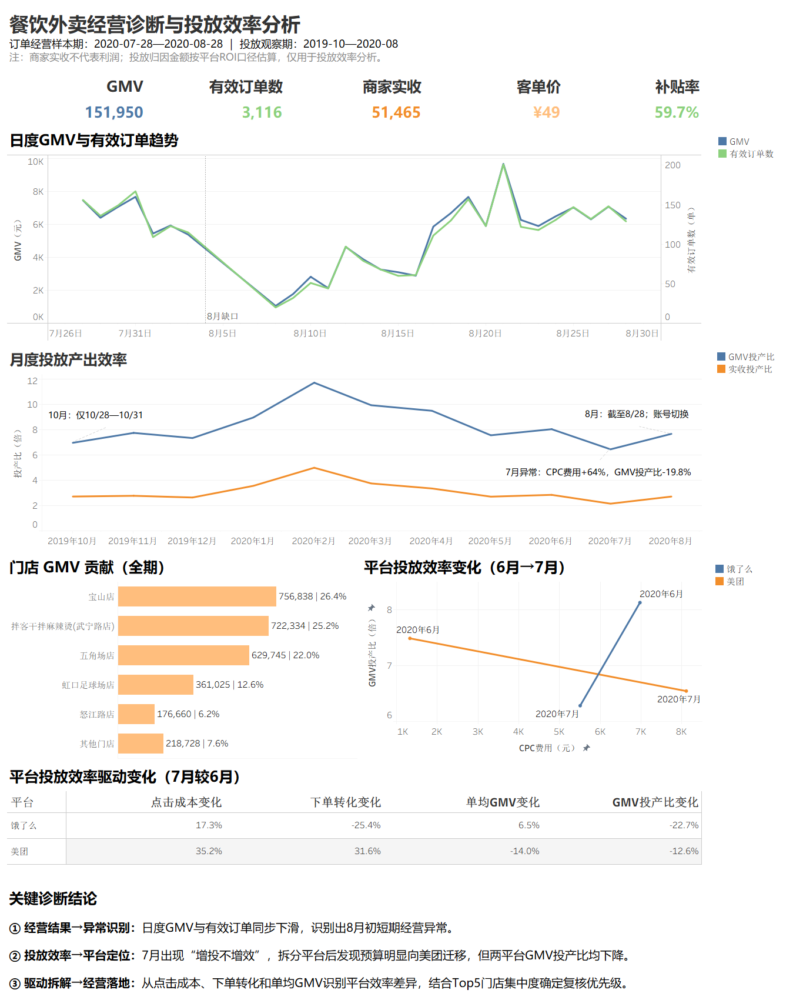

# 餐饮外卖经营诊断与投放效率分析

> 求职作品集 Case 01｜Business / Operations Analysis｜Tableau

**状态：Portfolio Ready**

## 项目目标

围绕餐饮外卖业务的增长质量与投放效率，构建经营诊断看板，并沿着以下主线逐层定位问题：

**经营结果 → 异常识别 → 投放效率 → 平台定位 → 驱动拆解 → 经营落地**

## 核心发现

- 订单经营样本期内，日度 GMV 与有效订单同步下滑，识别出 8 月初短期经营异常。
- 7 月出现明显“增投不增效”：CPC 投放费用较 6 月增长 **64.0%**，但 GMV 投产比下降 **19.8%**。
- 平台拆解显示预算明显向美团侧迁移，但美团、饿了么 GMV 投产比均下降；进一步从点击成本、下单转化和单均 GMV 拆解后，识别出两平台不同的效率损失机制。
- Top5 门店贡献约 **92.4%** 的全期 GMV，可据此确定后续经营复核的优先级。

## 分析方法

- **经营结果层**：GMV、有效订单、商家实收、客单价、补贴率
- **投放效率层**：CPC 费用、GMV 投产比、实收投产比
- **平台定位层**：美团 / 饿了么的费用与投产效率变化
- **驱动拆解层**：点击成本、下单转化率、单均 GMV
- **经营落地层**：门店 GMV 贡献 Top5 + 其他

## Dashboard

[查看 PDF 版本](assets/dashboard_final.pdf)

## 数据口径

- **订单经营样本期**：2020-07-28—2020-08-28
- **投放观察期**：2019-10—2020-08
- 商家实收不代表利润；投放归因金额按平台 ROI 口径估算，仅用于投放效率分析。

## 工具

**Tableau｜Excel｜经营指标拆解｜可视化分析**

## Portfolio Note

本仓库用于求职作品展示，仅保留可公开的分析结果、方法与可视化产出；内部项目管理记录、工作流与过程性材料不在此仓库公开。
